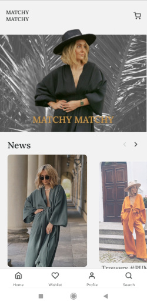
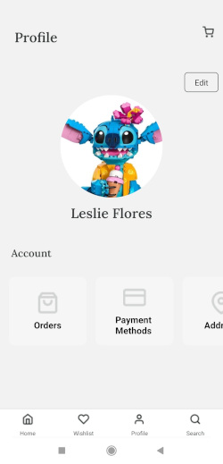

<h1 align="center">Aplikacja Mobilna Sklepu Odzieżowego </h1>

## Opis Projektu

Projekt aplikacji mobilnej sklepu odzieżowego został stworzony przez zespół studentów Politechniki Świętokrzyskiej w ramach przedmiotu "Aplikacje Mobilne - Projekt". Aplikacja jest dedykowana platformie React Native, co pozwala na łatwe przenoszenie między różnymi systemami operacyjnymi mobilnymi.

## Showcase Zdjęć Projektu

1. Ekran powitalny
   

2. Ekran główny/Home:
   

3. Katalog produktów:
   

4. Ekran koszyka:
   

5. Profil użytkownika:
   

## Funkcjonalności

    Logowanie i rejestracja użytkowników
    Zarządzanie profilem użytkownika, w tym dodawanie zdjęcia profilowego za pomocą aparatu
    Przeglądanie katalogu produktów z możliwością filtrowania
    Składanie zamówień oraz przeglądanie historii zamówień
    Zarządzanie koszykiem zakupów
    Dodawanie produktów do listy życzeń
    Edycja danych adresowych i płatniczych użytkownika
    Wsparcie dla ekranów o różnych rozdzielczościach

## Technologie

Projekt wykorzystuje technologie takie jak:

    React Native
    React Navigation
    Expo SQLite
    Expo File System
    Expo Image Picker
    Expo Font

## Struktura Projektu

Projekt został podzielony na moduły, co ułatwia zrozumienie kodu i rozwijanie poszczególnych części aplikacji. W repozytorium znajdują się katalogi odpowiadające różnym funkcjonalnościom, takie jak autentykacja, obsługa zamówień, czy obsługa katalogu produktów.
Instalacja i Uruchamianie

    Sklonuj repozytorium na swoje urządzenie.
    Wejdź do katalogu projektu.
    Zainstaluj zależności poleceniem: npm install.
    Uruchom aplikację komendą: npm start lub expo start.

## Podział Pracy

    Paweł Sroka: Moduł katalogu produktów, moduł profilu użytkownika.
    Adam Kołodziejczyk: Moduł koszyka, moduł zamówień.
    Przemysław Kusztal: Moduł logowania, moduł rejestracji.
    Kajetan Gadomski: Moduł listy życzeń, moduł filtrowania.

## Autorzy

    Przemysław Kusztal
    Adam Kołodziejczyk
    Kajetan Gadomski
    Paweł Sroka

## Licencja

Projekt jest dostępny na licencji MIT. Zapraszamy do współpracy i rozwijania aplikacji!